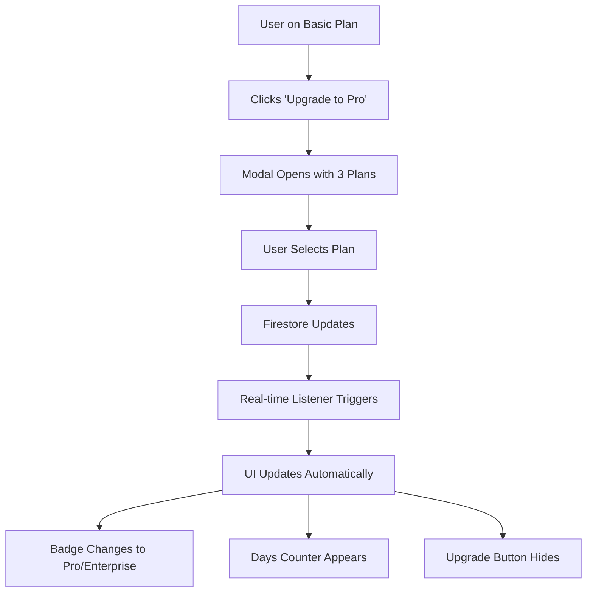

# 🚀 Global IP Platform - Feature Updates

## ✨ New Features Added

### 1. 💎 Subscription Management System

#### Features:
- **Upgrade to Pro Button** in sidebar (visible only for Basic users)
- **3 Pricing Tiers:**
  - 🆓 **Basic** - Free
  - 👑 **Pro** - $49/month (Most Popular)
  - 💼 **Enterprise** - $199/month
  
#### Account Level Display:
- **Pro/Enterprise Users:** Blue-purple gradient badge with Crown icon
- **Basic Users:** Gray gradient badge with Zap icon
- **Days Remaining Counter:** Shows subscription time left (for Pro/Enterprise)

#### Real-time Updates:
- Uses Firestore `onSnapshot` for instant subscription changes
- No page refresh needed when upgrading
- Automatic UI update across all components

#### Data Storage Location:
📍 **Firestore Database Path:** `users/{userId}`

**Fields Stored:**
```javascript
{
  subscriptionType: "basic" | "pro" | "enterprise",
  subscriptionPrice: 0 | 49 | 199,
  subscriptionStartDate: Timestamp,
  subscriptionEndDate: Date (30 days from start),
  subscriptionUpdatedAt: Timestamp
}
```

**Subscription Information Display:**
- Visible in Dashboard welcome card
- Shows exact Firestore path and stored fields
- Displays current subscription status
- Shows days remaining for paid subscriptions

---

### 2. 📧 Contact Form

**Location:** Sidebar → Contact Us

**Features:**
- Full name, email, phone, subject, and message fields
- Email integration via EmailJS
- Success confirmation animation
- Direct email fallback option
- All messages sent to: **vikaskumaryadav068@gmail.com**

**Form Fields:**
- ✅ Name (required)
- ✅ Email (required)
- ⭕ Phone (optional)
- ✅ Subject (required)
- ✅ Message (required)

---

### 3. ⭐ Feedback Form with Star Ratings

**Location:** Sidebar → Feedback

**Rating Categories:**
1. 🎨 **User Interface & Design** (1-5 stars)
2. ⚡ **Performance & Speed** (1-5 stars)
3. 🛠️ **Features & Functionality** (1-5 stars)
4. 💬 **Customer Support** (1-5 stars)
5. 🌟 **Overall Experience** (1-5 stars)

**Features:**
- Interactive star rating system
- Real-time average rating calculation
- Optional text feedback
- User info auto-populated from profile
- Success confirmation
- Emails sent to: **vikaskumaryadav068@gmail.com**

**Data Sent:**
```javascript
{
  user_name: "User Name",
  user_email: "user@example.com",
  user_id: "firebase_uid",
  ui_rating: 5,
  performance_rating: 4,
  features_rating: 5,
  support_rating: 5,
  overall_rating: 4,
  average_rating: 4.6,
  feedback_message: "Optional text feedback"
}
```

---

### 4. 🔗 Enhanced Footer with Quick Links

**Sections:**

#### About
- Platform description

#### Quick Links
- Dashboard
- Search Patents
- My Profile

#### Support
- Contact Support
- Send Feedback
- Email Support
- Documentation

#### Developer Information
- **Name:** Vikas Yadav
- **Role:** Full Stack Developer
- **Email:** vikaskumaryadav068@gmail.com
- **Social Links:** GitHub, LinkedIn

#### Legal Links
- Privacy Policy
- Terms of Service
- Cookie Policy

---

### 5. 📱 Full-Screen Optimized Layout

**Dashboard Improvements:**
- Changed from 4-column to 5-column grid for better space utilization
- Increased chart heights (260px → 300px)
- Better responsive design
- Improved mobile layout
- More breathing room for content

**Layout Structure:**
```
┌─────────────────────────────────────┐
│  Main Content (4 cols)  │ Sidebar  │
├─────────────────────────────────────┤
│     Full Width Charts (5 cols)      │
└─────────────────────────────────────┘
```

---

## 🔧 Technical Implementation

### Dependencies Added:
```bash
npm install @emailjs/browser echarts echarts-for-react
```

### New Components:
1. `ContactForm.jsx` - Contact form with EmailJS integration
2. `FeedbackForm.jsx` - Feedback form with star ratings
3. `UpgradeModal.jsx` - Subscription upgrade modal (enhanced)

### Updated Components:
1. `Sidebar.jsx` - Added Contact & Feedback menu items + Upgrade button
2. `Dashboard.jsx` - Added subscription info display & days remaining
3. `App.jsx` - Added real-time subscription listener & new pages
4. Enhanced footer with quick links

### Files Created:
- `EMAILJS_SETUP.md` - Complete EmailJS configuration guide

---

## 📊 Subscription Flow



---

## 🎯 Usage Guide

### For Users:

1. **Upgrading Subscription:**
   - Click "Upgrade to Pro" in sidebar
   - Choose your plan
   - Click upgrade button
   - Subscription activates instantly

2. **Contacting Support:**
   - Click "Contact Us" in sidebar or footer
   - Fill out the form
   - Submit - email sent automatically

3. **Sending Feedback:**
   - Click "Feedback" in sidebar or footer
   - Rate each category (1-5 stars)
   - Add optional comments
   - Submit feedback

### For Developers:

1. **EmailJS Setup:**
   - See `EMAILJS_SETUP.md` for complete guide
   - Get Service ID, Template IDs, and Public Key
   - Update `ContactForm.jsx` and `FeedbackForm.jsx`

2. **Testing Subscriptions:**
   ```javascript
   // In Firestore, manually update:
   users/{userId} → subscriptionType: "pro"
   // UI will update in real-time
   ```

3. **Checking Subscription Data:**
   - Open Dashboard
   - Look at blue info box in welcome card
   - Shows exact Firestore path and values

---

## 🐛 Known Issues & Future Improvements

### Current Limitations:
- EmailJS requires manual setup (see EMAILJS_SETUP.md)
- Payment processing not implemented (upgrade is instant)
- Subscription renewal not automated

### Planned Features:
- Payment gateway integration (Stripe/PayPal)
- Automatic subscription renewal
- Email notifications for expiring subscriptions
- Invoice generation
- Subscription history

---

## 📧 Email Configuration

**Important:** Email functionality requires EmailJS setup!

**Recipient Email:** vikaskumaryadav068@gmail.com

**Setup Steps:**
1. Create EmailJS account
2. Connect Gmail account
3. Create 2 templates (Contact & Feedback)
4. Get Service ID, Template IDs, Public Key
5. Update component files
6. Test forms

**Detailed Guide:** See [EMAILJS_SETUP.md](./EMAILJS_SETUP.md)

---

## 🎨 UI/UX Enhancements

### Visual Improvements:
- ✅ Animated Pro badge with pulse effect
- ✅ Gradient backgrounds throughout
- ✅ Hover effects on all interactive elements
- ✅ Loading states and success animations
- ✅ Responsive design for all screen sizes
- ✅ Smooth transitions

### Color Scheme:
- **Pro/Enterprise:** Blue to Purple gradient (#3b82f6 → #9333ea)
- **Basic:** Gray gradient (#9ca3af → #4b5563)
- **Success:** Green tones
- **Accents:** Orange/Yellow for upgrade button

---

## 🔒 Security & Privacy

### Data Protection:
- Subscription data stored in Firestore with user authentication
- EmailJS credentials not exposed in frontend
- User email verification required
- Real-time security rules apply

### Privacy:
- User data only shared via forms with consent
- Email sent only to specified recipient
- No third-party tracking
- GDPR-friendly structure

---

## 📈 Metrics & Analytics

### Trackable Events:
- Subscription upgrades
- Contact form submissions
- Feedback form submissions with ratings
- Page navigation
- Feature usage

### EmailJS Limits:
- **Free Tier:** 200 emails/month
- **Paid Plans:** Higher limits available

---

## 🚀 Deployment Checklist

Before deploying to production:

- [ ] Configure EmailJS credentials
- [ ] Test contact form email delivery
- [ ] Test feedback form email delivery
- [ ] Verify subscription updates work in real-time
- [ ] Check all links in footer
- [ ] Test on mobile devices
- [ ] Verify Firestore security rules
- [ ] Set up email monitoring
- [ ] Configure error logging

---

## 👨‍💻 Developer Information

**Created by:** Vikas Yadav  
**Email:** vikaskumaryadav068@gmail.com  
**Role:** Full Stack Developer  
**Technologies:** React, Firebase, EmailJS, Tailwind CSS

---

## 📝 Version History

**v2.0.0** - December 22, 2025
- ✅ Added subscription management with 3 tiers
- ✅ Real-time subscription updates
- ✅ Subscription time remaining display
- ✅ Contact form with EmailJS
- ✅ Feedback form with star ratings
- ✅ Enhanced footer with quick links
- ✅ Full-screen optimized dashboard
- ✅ Developer information section
- ✅ Data storage location display

**v1.0.0** - Previous Release
- Initial dashboard implementation
- User authentication
- Search functionality
- Profile management

---

## 🆘 Support

**Need Help?**
- 📧 Email: vikaskumaryadav068@gmail.com
- 📝 Submit feedback via in-app form
- 🔧 Check EMAILJS_SETUP.md for email issues
- 📚 Review component documentation

---

## 📜 License

© 2025 Global IP Intelligence Platform. All rights reserved.
